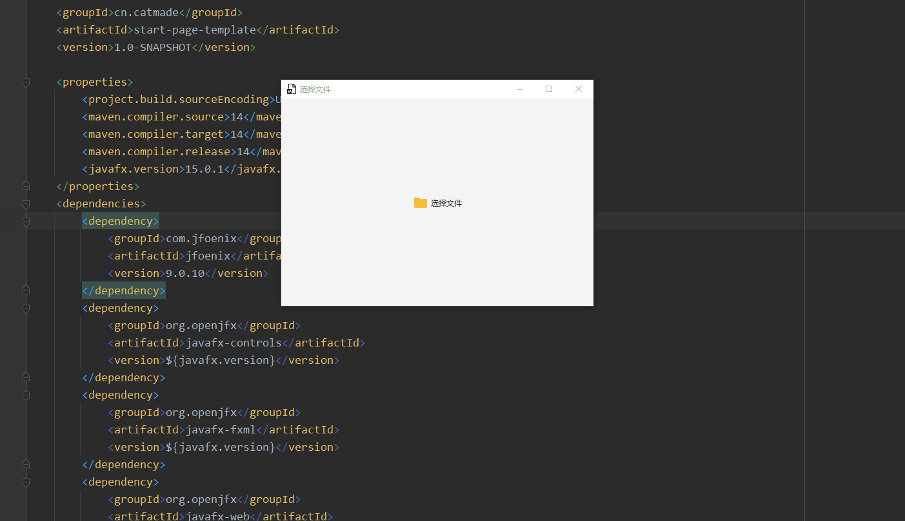

# jfx desktop template

---

## 环境

-   Java 			14
-   jfoenix        9.0.10
-   openjfx-*   15.0.1

## 模板

### 带有开始界面的模板（[start-page-template](./start-page-template)）

#### 功能

1.  程序启动后，会显示启动界面，要求用户打开文件
2.  调用系统文件对话框
3.  用户选择文件后，切换到主界面，同时将用户选择的文件传递给主界面

#### 效果

